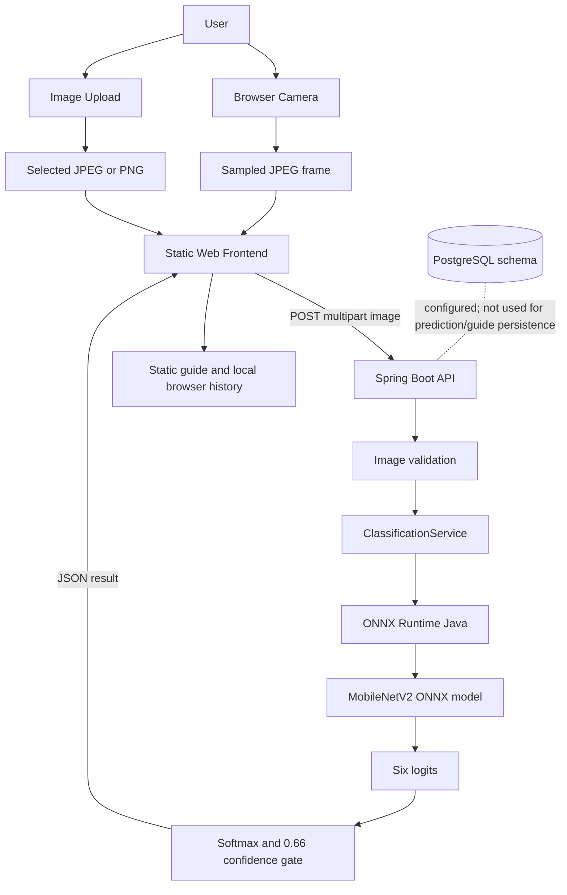
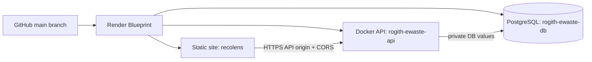

# RECOLENS

## AI-Based E-Waste Classification and Recycling Assistant Using Java & Machine Learning

**Product:** Recolens — AI-Powered E-Waste Identification & Recycling Assistant
**Tagline:** Point. Identify. Recycle.
**Project type:** Integrated academic software prototype
**Technology domains:** Artificial intelligence and machine learning, computer vision, Java backend, browser-based web application, e-waste management
**Repository:** [https://github.com/samdavi-ai/rogith_java-ML](https://github.com/samdavi-ai/rogith_java-ML)
**Local project:** `/Users/samdavi/rogith`
**Report date:** 2 October 2026

> This report describes the checked-in implementation and associated local experiment artifacts. Deployment and test statements are marked as configured, previously observed, or not tested. It does not claim that planned capabilities are complete.

---

## 1. Executive Summary

Electronic products are replaced, repaired, stored, and discarded by people who may not know what material or collection route applies to a particular item. A visual assistant can make the first step easier: it can offer a likely category and show general preparation guidance without requiring the user to know the product name. Recolens was built as a practical demonstration of this workflow. It is an experimental aid, not a certified waste assessment service, and its six-category model cannot determine the correct route for every electronic product or location.

A user can select a JPG or PNG image or activate a browser camera. The frontend checks the selected file's MIME type and size, previews it, and sends it to the backend as a multipart request. For camera mode, the browser obtains a video-only `MediaStream`, shows it in a video element, and periodically captures an individual frame to a canvas. It resizes the longest edge to no more than 640 pixels, encodes the still frame as JPEG at quality 0.78, and submits one inference request at a time at a default interval of one second. This is a sequence of sampled still images, not a continuously uploaded video stream. Camera access depends on browser permission and a secure context; rear-camera preference and camera switching are available where supported. A flashlight button is displayed only when the active camera track exposes torch capability and accepts the corresponding constraint.

The AI/ML component is a trained MobileNetV2 image classifier. The training code uses ImageNet-pretrained MobileNetV2 as a feature extractor, attaches global average pooling, dropout, and a six-logit classification layer, then fine-tunes the final 20 backbone layers while keeping Batch Normalization layers frozen. A preprocessing and export pipeline writes an ONNX artifact. The model accepts RGB float32 input resized with bilinear interpolation to 224 by 224, normalized with `pixel / 127.5 - 1`, and arranged as NCHW `[1,3,224,224]`. Its output has six logits. Java applies softmax and maps the scores to the ordered labels in `ml/class_mapping.json`.

The Java application uses Spring Boot 3.3.5 and ONNX Runtime Java 1.20.0. `ClassificationController` accepts the image, `ClassificationService` validates the declared MIME type, actual file format, decoded image and dimensional limits, and `OnnxClassifier` prepares a tensor and runs inference. It returns a named category only if the top score reaches the configured 0.66 floor; otherwise it returns `UNSURE` with no category name. A score is a model output, not a scientifically calibrated probability of correctness. The API exposes `POST /api/classifications` and `GET /health`; no guide, account, or history endpoint exists.

The application layer and AI/ML layer are distinct. JavaScript handles user interaction, network calls, static guidance, result cards, and browser-local recent history. PostgreSQL is configured and `database/schema.sql` defines a relational schema for future users, sources, categories, guides, images, classifications, predictions, and activity records. However, the current app does not persist classifications or history in PostgreSQL and does not retrieve its recycling guidance from those tables. The current guide is static content in `app.js`; the sign-in control is a placeholder. This is an important implementation boundary: database configuration and tables are present, but persistence features are not implemented.

The system is packaged with Docker and configured in Render Blueprint YAML as a static frontend, a Docker-based Spring API, and a PostgreSQL service. The deployed URLs recorded for this project are the static site at `https://recolens-h55g.onrender.com/` and API at `https://rogith-ewaste-api.onrender.com`. Prior deployment checks recorded API health/model readiness, CORS checks, and a successful held-out phone image request. These historical checks are not a guarantee of current availability; the deployment should be rechecked after changes. A physical Android or iPhone camera/torch test is not recorded.

Recorded ML metrics are 98.33% accuracy, 98.76% macro F1, and 98.34% weighted F1 on a small held-out set of 60 images. Only three light-bulb images appear in the test set, and the source dataset contains no physical-device identities. An excluded-class experiment showed that the model can confidently force an unsupported image into a supported class. Therefore, these numbers demonstrate a functioning experiment and integration, not field accuracy or open-set recognition. Recolens demonstrates applied computer vision, model export, Java inference, browser camera sampling, API validation, and cloud packaging while retaining clear limitations around data size, uncertainty, local recycling authority, user accounts, and durable history.

### System layers at a glance

| Layer | Implemented responsibility |
|---|---|
| Presentation | HTML/CSS/JavaScript page, upload and camera interactions, result presentation, static preparation guidance, browser-local history. |
| Application | Spring Boot REST API, image validation, model lifecycle/readiness, request/error contract, CORS and database connection configuration. |
| AI/ML | MobileNetV2 training/evaluation pipeline, class map, exported ONNX model, Java-side ONNX Runtime inference. |
| Data | PostgreSQL schema and connection initialization are configured; current prediction/history/guidance application persistence is not implemented. |
| Deployment | Docker images, Compose stack, Render Blueprint for frontend/API/PostgreSQL. |

## 2. Problem Statement

People can have difficulty identifying what an obsolete device is called, whether a component contains a battery, or what preparation is sensible before handing it over. An item that looks like ordinary scrap may contain reusable components or materials that should use an e-waste channel. Manual identification depends on the user's experience, product labels, and access to local advice. A web assistant that accepts a photo can reduce the friction of the initial identification step and make basic handling information easier to find.

RecoLens addresses this narrow point in the disposal journey: **visual classification of a single item into one of six trained categories, followed by general preparation advice**. It does not locate a recycler, determine legal classification, assess hazardous condition, or guarantee a local facility will accept an item. No unsupported global waste-volume statistics are used in this report.

## 3. Proposed Solution

RecoLens presents an upload path and a sampled-camera path. Both result in an image sent to the same classification API. The backend validates the image and applies the same model input contract used at training/export. The model produces six class logits; the API converts them to scores, selects the highest scoring class, and applies a minimum confidence rule. If the score is below 0.66, the API returns an unsure result and the frontend withholds class-specific guidance. For a named result, the frontend maps the display name to a static guide.

```text
User -> Camera or Upload -> Browser Frontend -> Spring Boot API
     -> Image Validation -> ONNX Runtime -> MobileNetV2
     -> Class + Score -> Confidence Gate -> Static Guide -> Result UI
```

The architecture includes PostgreSQL schema initialization, but there is no live database-backed guide lookup or prediction storage in the current feature flow.

## 4. Project Objectives

### Primary objectives represented in the implementation

- Identify images as one of six supported electronic-waste categories.
- Provide a photo-upload workflow and a browser-camera workflow.
- Return a model result with a confidence score and an explicit unsure state.
- Display general preparation and safety guidance for supported guide categories.
- Expose model readiness and classification through REST endpoints.
- Integrate model inference into a Java service through ONNX Runtime.
- Package the service and static app for local Compose and Render deployment.

### Objectives not yet fulfilled as user features

- Persisting prediction history or uploaded images to PostgreSQL.
- User registration, authentication, and account-linked history.
- Finding verified recycling facilities for a user's jurisdiction.
- Identifying arbitrary e-waste classes or detecting multiple objects.
- Verifying camera/flashlight behavior across real physical phones.

## 5. System Overview and Architecture



### Block responsibilities

- **Camera / upload:** obtains a still image from either a file selection or a sampled browser frame.
- **Web frontend:** previews the input, sends the HTTP request, displays classification/uncertainty, maps recognized categories to general guide content, and stores a short local history list.
- **Spring Boot API:** accepts HTTP requests, validates the image, calls the classifier, handles errors, and exposes model health.
- **ONNX Runtime:** loads the ONNX model into an inference session and executes tensors inside the Java process.
- **Model:** computes a six-class score vector from the supplied image tensor.
- **Confidence gate:** suppresses the category name below the 0.66 minimum score. It is a threshold policy, not an open-set classifier.
- **PostgreSQL:** initialized and connected by configuration; its schema anticipates persistence and guide data, but those features are not wired into current API behavior.

## 6. High-Level Architecture

### Layer 1 — Presentation

`index.html` contains the page structure; `styles.css` defines the responsive visual design; `app.js` handles upload, results, guide mapping, UI state, and browser-local history; `camera-controller.js` owns camera stream lifecycle, sampled frame encoding, inference requests, stability voting, and optional torch state. No React, Angular, Vue, or frontend package manager is present. For the current small static page, the browser's native APIs and a small set of focused JavaScript modules meet the implemented needs without adding a framework runtime or build pipeline.

### Layer 2 — Application/API

Spring Boot hosts a Java REST application. A controller maps the multipart endpoint, a service validates and decodes image input, an ONNX adapter owns model initialization and execution, and a controller exposes health. Exception handlers convert recognized service failures into a common JSON envelope. `SecurityConfig` currently allows all routes, disables CSRF, and restricts CORS origins to configuration. There is no account authentication.

### Layer 3 — AI/ML

The Python training code uses TensorFlow/Keras and scikit-learn utilities to train/evaluate an ImageNet-pretrained MobileNetV2 image classifier. The pipeline exports and validates an ONNX model; Python is not part of the deployed Java runtime. The ordered label map is shared across train, export, and Java.

### Layer 4 — Data

PostgreSQL is present as an infrastructure dependency and as an idempotently initialized schema. Foreign keys and indexes are defined. The current app does not define JPA entity/repository code for the domain tables and does not record inference results. Browser history is stored under the `sc-history` local-storage key.

### Layer 5 — Deployment

Docker packages the API with Java 17 and bundles the ONNX model and class mapping. A second Nginx Docker image serves the root static files and proxies API requests in local Compose. `render.yaml` configures a Render static site, Docker API service, and PostgreSQL database. Render supplies HTTPS endpoints; environment variables connect services and configure model paths/CORS.

## 7. Frontend Technology and User Experience

The frontend uses semantic HTML, CSS, and browser-native JavaScript. The page includes upload preview, camera panel, result and uncertainty states, guide content, and recent history. Its client API call uses `fetch` with `FormData`, with the file/frame under the exact part name `image`. The UI contains handling states for camera permission, unsupported camera APIs, backend/model unavailability, network failures, and invalid uploads.

### Upload workflow

```text
Open RecoLens -> choose photo -> select JPEG/PNG -> preview
-> submit image -> API validation -> ONNX inference
-> result or Unsure -> matching static guide (if named result)
```

The browser rejects files whose declared MIME type is not JPEG/PNG and rejects files larger than 10 MiB before requesting inference. The API independently validates the actual decoded image.

### Live camera workflow

```text
Open camera panel -> grant permission -> preview video
-> sample a frame -> resize and JPEG encode -> multipart API request
-> receive model response -> stabilize repeated result -> display
```

Camera operation requests video only, without microphone access. It prefers `facingMode: environment` for detected mobile layouts and can enumerate/switch cameras where the browser permits it. Five recent predictions are retained for voting; at least three matching category votes are required before presentation as stable. Inference is nominally sampled each second and has a timeout. A request already in flight blocks another request; repeated service errors pause requests. This reduces image upload volume and avoids stacking slow requests, while accepting that the displayed result may lag scene changes.

The flashlight/torch control uses `MediaStreamTrack.getCapabilities().torch` and `applyConstraints`. It is capability-gated; the app cannot force support on a camera/browser that does not expose it.

## 8. Real-Time Camera Implementation

1. `navigator.mediaDevices.getUserMedia` requests a video `MediaStream` (no audio).
2. The selected stream is assigned to an HTML `<video>` element and played for the live preview.
3. At the configured interval, the controller checks that the video has decoded dimensions and draws the current frame to a canvas.
4. Canvas width/height are scaled proportionally so the longest edge is at most 640 pixels.
5. `canvas.toBlob` encodes a JPEG at quality 0.78. The frame is appended to `FormData` as `image`.
6. The controller sends `POST /api/classifications` to the configured API base. One request at a time is permitted; requests can be aborted when the camera stops.
7. A response enters a five-result voting window; three matching votes are needed to declare a stable result.
8. Stopping the camera cancels timers/active work and stops media tracks; restart creates a new stream after permission/capability checks.

Desktop uses the browser's available webcam. Mobile browsers require HTTPS (or a browser's localhost exception) and user permission. The app requests the rear-facing preference on mobile but actual camera selection is browser-dependent. No full-resolution video file or stream is posted to the API. Sampling, resizing, and compression control bandwidth and inference request cadence; they do not guarantee a particular device's inference speed.

## 9. AI/ML Component: What Makes RecoLens an AI/ML Project?

The application includes a learned model whose parameters were optimized from labeled images. It computes visual features through convolutional layers and transforms them into class logits. At inference, the model's learned weights influence the output; the software does not identify objects through hand-written rules such as filename checks, color thresholds, or product keyword matching.

```text
Image -> RGB decode -> 224x224 resize -> normalized tensor
       -> MobileNetV2 feature extractor -> dense six-logit head
       -> Java softmax -> ranked labels + confidence gate
```

Traditional rule-based classification maps explicit rules to a category; a learned image classifier derives decision patterns from training examples and may generalize imperfectly to new images. Recolens uses ML for the visual category estimate. The rest of the system—camera access, image validation, HTTP routing, UI state, guide text, storage and deployment—is conventional software. ONNX Runtime is ML execution infrastructure, not the trained model itself.

## 10. Machine Learning Model and Dataset

### Model architecture

The repository contains a trained MobileNetV2 model version `1.0.0` and a production ONNX artifact. The reported architecture is ImageNet MobileNetV2 without its original top, used as a feature extractor; Global Average Pooling, Dropout(0.25), and a Dense layer with six logits form the classifier head. Training initially freezes the backbone and then fine-tunes its last 20 layers; Batch Normalization layers remain frozen. The original MobileNetV2 paper describes inverted residual blocks, depthwise convolutions in expanded intermediate representations, and linear bottlenecks. Those are properties of the selected architecture, not custom blocks authored by this project. [MobileNetV2 paper](https://arxiv.org/abs/1801.04381)

### Dataset provenance and categories

The selected source is the [Custom Bangladeshi E-Waste Image Dataset, Mendeley Data V1](https://data.mendeley.com/datasets/77383kmdnw/1), published under CC BY 4.0. The source archive is present in the local workspace under `ml/data/raw/` but is ignored by Git; prepared data and `.keras` checkpoints are also local artifacts and are not committed. The source contains 2,157 labeled images across 12 waste classes with YOLO annotations. Six classes are selected for the classifier:

| ID | Model ID | User-facing label | Test support |
|---:|---|---|---:|
| 0 | `battery_waste` | Battery waste | 15 |
| 1 | `keyboard` | Keyboard | 8 |
| 2 | `light_bulb` | Light bulb | 3 |
| 3 | `mobile_phone` | Mobile phone | 12 |
| 4 | `mouse` | Mouse | 6 |
| 5 | `pcb` | Printed circuit board | 16 |

The report's final selected-class split is 523 training images, 60 validation images, and 60 held-out test images. The seeded split groups same-class near-duplicate candidates (dHash distance at most 3) and source filename families before splitting, to reduce leakage. Training-only augmentation is kept in train. There are no physical-object identity IDs, so visually similar images may still show the same object or capture conditions. A further 205 excluded-class images were held aside to characterize forced predictions; they do not constitute independent household non-e-waste validation.

### Recorded test metrics

| Metric on 60-image test split | Recorded value |
|---|---:|
| Accuracy | 0.9833 |
| Macro precision | 0.9872 |
| Macro recall | 0.9889 |
| Macro F1 | 0.9876 |
| Weighted precision | 0.9846 |
| Weighted recall | 0.9833 |
| Weighted F1 | 0.9834 |

The single error in the report is a battery image predicted as mobile phone; its top Keras score was 0.5203. Per-class performance has low statistical support for some categories (only three light-bulb test images). The 205 excluded-class images received forced supported predictions, with mean maximum confidence 0.7837 and 92 at or above 0.85. This demonstrates that the confidence threshold is not an open-set detector. Do not interpret the test metrics as real-world accuracy.

Confusion matrix (rows = actual class, columns = predicted class; class order follows the table above):

| Actual \ Predicted | Battery waste | Keyboard | Light bulb | Mobile phone | Mouse | PCB |
|---|---:|---:|---:|---:|---:|---:|
| Battery waste | 14 | 0 | 0 | 1 | 0 | 0 |
| Keyboard | 0 | 8 | 0 | 0 | 0 | 0 |
| Light bulb | 0 | 0 | 3 | 0 | 0 | 0 |
| Mobile phone | 0 | 0 | 0 | 12 | 0 | 0 |
| Mouse | 0 | 0 | 0 | 0 | 6 | 0 |
| PCB | 0 | 0 | 0 | 0 | 0 | 16 |

## 11. Data Preprocessing

| Step | Actual implementation | Why it is used and inference effect |
|---|---|---|
| Decode and RGB | Training dataset loader uses `color_mode="rgb"`; Java decodes the image and reads RGB channel values. | Supplies a consistent three-channel input expected by the network. |
| Resize | Bilinear interpolation to 224×224, stretching the complete image (no aspect-preserving crop). | Produces the fixed tensor size; stretching can distort object proportions. |
| Normalize | Float32 `pixel / 127.5 - 1.0`, mapping byte intensities approximately to [-1,1]. | Matches the MobileNetV2 training/export input contract. |
| Layout | Training maps NHWC images to NCHW; Java creates `[1,3,224,224]`. | Keeps the exported model and Java tensor shape consistent. |
| Augmentation | No online random image augmentation is applied in the training loader. Prepared train-only variants are part of the training split; validation/test retain original selected examples. | Augmented examples increase training variation without contaminating validation/test. |
| Camera frame encoding | Browser scales to max edge 640 and creates JPEG quality 0.78. | Reduces bytes and server workload; this is client transport preparation, not the model's 224-pixel preprocessing. |

The Java decoder does not apply an explicit EXIF orientation transform. Training and Java should be rechecked on portrait phone photos where EXIF orientation matters. The declared model input contract should remain synchronized if preprocessing changes.

## 12. Model Training Pipeline

```text
Labeled source -> audit/deduplicate/group -> seeded split
-> TensorFlow image datasets -> MobileNetV2 transfer learning
-> validation loss checkpoint/early stopping -> held-out evaluation
-> ONNX export -> Keras/ONNX parity validation -> Java serving
```

Actual training settings recorded in `ml/reports/TRAINING_REPORT.md` and implemented in `ml/training/train.py`:

- Seed: 42; deterministic operations are enabled where TensorFlow permits.
- Batch size: 16.
- Input: 224×224 RGB, normalized, NCHW.
- Loss: sparse categorical cross-entropy from logits.
- Optimizer: Adam, learning rate `1e-3` in the frozen phase, `1e-5` in fine-tuning.
- Epoch limits: up to 12 frozen-backbone epochs then up to 8 fine-tuning epochs.
- Fine-tuning: last 20 backbone layers trainable except Batch Normalization layers, which remain frozen.
- Early stopping: validation loss, patience 3, restore best weights.
- Checkpointing: `ModelCheckpoint` retains best `val_loss` checkpoint; training refuses to overwrite an existing `.keras` checkpoint.
- Class weighting: balanced weights computed from training labels.

The recorded selected checkpoint achieved validation accuracy 1.0000 on 60 images and validation loss 0.018006. These are reported observations on a small validation split; the held-out test result is reported separately above.

## 13. Model Export and ONNX Runtime

The export flow converts the trained Keras model to ONNX and validates the exported model against Keras on the validation images. The checked-in artifact is `ml/models/ewaste.onnx`; the classifier's class map is `ml/class_mapping.json`. Current `onnx_validation.json` records **PASS**, 60/60 argmax agreements, maximum absolute logit difference `5.5313e-05`, maximum probability difference `7.2122e-06`; its Python ONNX-only latency numbers are not Java or Render benchmarks.

ONNX is an interchange format that allows a model trained in one supported ML stack to be loaded by a compatible runtime elsewhere. ONNX Runtime provides a Java API for running ONNX models on the JVM. [ONNX Runtime Java guide](https://onnxruntime.ai/docs/get-started/with-java.html), [ONNX Runtime overview](https://onnxruntime.ai/docs/). The Java server uses `OrtEnvironment`, an `OrtSession`, `OnnxTensor`, and `session.run(...)`. Its production Docker image includes Java and ONNX artifacts; it does not require Python for serving inference. Python remains relevant for training/evaluation, not for the online classification request.

The startup adapter checks that model and class map files exist, IDs are contiguous/ordered, input is NCHW with three channels and 224×224 spatial dimensions, and output count agrees with the map. Java decodes/resizes the image, fills the tensor in channel-plane order, runs the session, applies softmax to logits, sorts scores, reports up to three alternatives, and returns the top class only at or above the minimum threshold.

## 14. Java Backend and Spring Boot

Spring Boot 3.3.5 runs on Java 17. The application is structured around Spring components and constructor injection. Spring Boot documents automatic component registration and dependency injection for components such as services and controllers. [Spring Boot beans and dependency injection](https://docs.spring.io/spring-boot/reference/using/spring-beans-and-dependency-injection.html)

| Module/class | Responsibility | Inputs and outputs | Main dependencies |
|---|---|---|---|
| `AssistantApplication` | Starts the Spring application. | Process configuration -> running app. | Spring Boot. |
| `ClassificationController` | Handles `POST /api/classifications`. | Multipart `image` -> JSON envelope with `classification`. | `ClassificationService`. |
| `ClassificationService` | Enforces image size/MIME/format/dimension/pixel limits, decodes the image, calls classifier. | `MultipartFile` -> `ClassificationView` or typed exception. | `OnnxClassifier`, Spring multipart/ImageIO. |
| `OnnxClassifier` | Loads model/map, verifies shapes, preprocesses, runs ONNX, applies softmax and thresholds. | `BufferedImage` -> status, class, confidence, alternatives. | ONNX Runtime, Jackson, model and map files. |
| `HealthController` | Reports service and model readiness. | GET `/health` -> status map. | `OnnxClassifier`. |
| `ApiExceptionHandler` | Maps upload/model/unexpected errors to envelope and HTTP status. | Java exceptions -> HTTP response. | Spring Web. |
| `SecurityConfig` | Sets CORS policy, CSP header, disables CSRF and permits all requests. | Configuration -> security filter chain. | Spring Security. |
| `DatabaseConfig` | Converts Render `postgres://` / `postgresql://` URL forms to JDBC; builds Hikari datasource. | DB URL/user/password -> `DataSource`. | HikariCP, PostgreSQL driver. |
| `camera-controller.js` | Browser camera, sampling, API calls, vote stability, stop/restart and torch. | Browser stream -> sampled request/results. | MediaDevices, canvas, Fetch. |
| `app.js` | Upload, guide/category mapping, UI rendering and local history. | UI events + JSON -> rendered page. | DOM, Fetch, localStorage. |

Spring Boot is used here as the Java HTTP/application framework: it packages an embedded web server, request routing, configuration, validation, dependency wiring, and executable JAR behavior. It does not itself implement machine learning; the ONNX adapter supplies inference. The project uses the Java 17 runtime in the backend Docker image.

## 15. REST API

The source declares two HTTP routes. No guide/history/login endpoint is present.

| Method | Endpoint | Purpose | Input | Output |
|---|---|---|---|---|
| GET | `/health` | Process and model readiness. | None. | `status`, `modelStatus`, plus `modelLoadTimeMs` only when ready. |
| POST | `/api/classifications` | Validate and classify one image. | `multipart/form-data`, required part `image`. | Envelope containing `data.classification`; classification includes status, nullable categoryName, confidence, confidenceLevel, alternatives, and `guide` (currently null). |

Example (illustrative shape based on `ApiModels`; values are illustrative):

```json
{
  "success": true,
  "data": {
    "classification": {
      "status": "CLASSIFIED",
      "categoryName": "Mobile phone",
      "confidence": 0.91,
      "confidenceLevel": "HIGH",
      "alternatives": [
        {"category": "Keyboard", "confidence": 0.04},
        {"category": "Mouse", "confidence": 0.02},
        {"category": "Printed circuit board", "confidence": 0.01}
      ],
      "guide": null
    }
  },
  "error": null
}
```

The API response wraps a `ClassificationView` under the `classification` property. `UNSURE` is still a successful HTTP 200 inference response, with `categoryName: null`. The API currently returns `guide: null`; frontend static guide lookup is performed after response receipt.

## 16. Image Validation, Error Handling and Confidence

The API accepts MIME type `image/jpeg` or `image/png`, then checks the decoded format matches the declared MIME type. It rejects empty/missing images, corrupt or unreadable content, files larger than 10 MiB, dimensions below 32 pixels or above 12,000 pixels on either side, and decoded images above 40 million pixels. The frontend prechecks type and file size, but backend checks remain authoritative.

| Condition | API behavior |
|---|---|
| Invalid/missing/corrupt or unsupported image | HTTP 400 `INVALID_IMAGE` |
| Multipart upload over maximum | HTTP 413 `IMAGE_TOO_LARGE` |
| Model or class map unavailable | HTTP 503 `MODEL_UNAVAILABLE` |
| ONNX/model metadata loading error | HTTP 503 `MODEL_LOAD_ERROR` |
| Unexpected API exception | HTTP 500 `INTERNAL_ERROR`, generic response text; detail logged on backend |
| Top score below 0.66 | HTTP 200 with status `UNSURE`, null category; frontend hides category advice |
| Camera permission blocked | Browser UI shows recovery/error state; no classification is fabricated |
| Network/backend failure | Camera loop exposes network status and pauses after repeated failures; upload flow shows an error rather than a guessed class |

Model confidence is the softmax score assigned by this model among its six supported classes. It is not established as a calibrated probability of correctness. A high score does not establish that an image belongs to one of the six classes. Current safeguards avoid a named category below the threshold but cannot prevent confident forced labels for unsupported images.

## 17. PostgreSQL and Recycling Knowledge Layer

`database/schema.sql` is run idempotently at startup in the Spring service; Hibernate is configured to validate rather than create/alter tables. The Compose PostgreSQL image also mounts the SQL file as an initialization script for a fresh database volume. The schema contains:

| Table | Purpose represented by schema | Important columns/relationships |
|---|---|---|
| `app_user` | Future user/account records. | UUID PK, unique email, password hash, display name, role constrained to USER/ADMIN, location fields. No authentication feature currently consumes it. |
| `source` | Source/jurisdiction metadata for guidance. | Name, organization, URL, jurisdiction, topic, last verified date, status constraint. |
| `ewaste_category` | Category records. | Unique slug, name, description, examples JSONB, hazard level, enabled, timestamps. |
| `recycling_guide` | Jurisdiction-scoped preparation guidance. | FK to category, optional FK to source, location fields, recycling method, JSONB preparation instructions, safety/data instructions, verification date, active flag. |
| `uploaded_image` | Image metadata/storage reference. | Unique storage key, SHA-256, MIME type, constrained size, dimensions, timestamp. No binary storage or application upload persistence is wired. |
| `classification` | Inference event metadata. | Optional user/image FKs with `ON DELETE SET NULL`, model version, inference time, creation timestamp. Not written by the API. |
| `prediction` | Ranked category score for classification. | Classification FK with cascade delete, category FK, confidence constrained 0..1, positive rank, unique classification/rank. Not written by the API. |
| `activity_log` | Future audit/activity records. | Optional actor FK, action, subject type/id, timestamp. No writer currently exists. |

Indexes are defined for classification creation order, user/time, prediction category, and active guide jurisdiction/category queries. UUID primary keys, foreign keys, `NOT NULL`, `UNIQUE`, `CHECK`, and partial-index constraints are in SQL. There are no seed rows. No JPA entities, repositories, or controllers for these domain tables are present. PostgreSQL therefore supports configured infrastructure and schema, not current prediction persistence.

The active recycling guidance is a **knowledge layer**, separate from the classifier. `app.js` has a static array of topic descriptions, preparation steps, and actions. The model estimates a supported visual category; frontend text provides general follow-up guidance. It is not a verified local collection directory. Current guidance does not query `recycling_guide` or `source` in PostgreSQL.

## 18. Security and Privacy

Implemented controls include CORS allowlisting via exact origins, CORS methods GET/POST/OPTIONS, allowed headers Content-Type/Authorization, credentials disabled, input format/size/dimension checks, sanitized generic errors for unexpected failures, CSP response policy, HTTPS on recorded Render endpoints, and environment-driven database credentials. `.env` is intended for local secrets and is excluded from version control. Docker/Render pass DB connection values using service environment configuration.

Limitations: all application endpoints are permitted; there is no authentication or user authorization. CSRF is disabled because the current API is public and stateless. The classification endpoint accepts uploaded bytes for inference, but the current service does not write them to the `uploaded_image` table or persist classification results. Browser-local history stores summaries in localStorage and is not account-protected. CORS is not authentication and does not prevent non-browser clients from calling the public API. Users should not upload sensitive personal images or treat the service as a secure private archive.

## 19. Docker and Render Deployment

### Docker / Compose

- Root `Dockerfile` is based on `nginx:1.27-alpine`; it copies the root static page/assets and uses `deployment/nginx.conf` to serve/proxy.
- `backend/Dockerfile` builds with Maven 3.9 and Eclipse Temurin 17, then runs the packaged JAR on Temurin 17 JRE. It copies `ml/models/ewaste.onnx` and `ml/class_mapping.json` into `/app/ml/...` and sets model path variables.
- `docker-compose.yml` defines `db` (`postgres:16-alpine`), `backend`, and `frontend`. The database has a health check, the API waits for it, and the frontend exposes `${WEB_PORT:-8088}:80`. A named volume stores local PostgreSQL files. `down -v` removes that local data.

Docker makes the API build/runtime inputs explicit and repeatable across compatible container hosts. It does not make model quality or service uptime inherently guaranteed.

### Render



`render.yaml` configures auto-deploy on commit, the static build `node deployment/build-frontend.js`, API Docker context at repository root, `/health` health check, Free plans, the API/model/CORS environment settings, and Render DB credentials references. Recorded URLs: [frontend](https://recolens-h55g.onrender.com/) and [API health](https://rogith-ewaste-api.onrender.com/health). Render assigned a suffixed frontend hostname because the unsuffixed `recolens.onrender.com` name was unavailable. Current live status must be checked in Render; a Blueprint is configuration, not proof of a successful deploy.

### Deployment evidence labels

- **Configured:** YAML defines static site, Docker API, PostgreSQL, health path, auto-deploy trigger, CORS and model/database environment references.
- **Deployed (previous project state):** Render services and URLs are recorded in prior deployment notes.
- **Previously verified:** prior checks recorded `/health` with model ready, CORS preflight to allowed origins, and upload/inference of a held-out mobile-phone image. An earlier phone smoke request produced 99.13% confidence. These are historical checks, not re-run for this report.
- **Not verified here:** current Render status on report generation; real physical Android/iPhone camera and flashlight compatibility; production load or uptime.

Render Free services may sleep and free database retention/expiry limits apply. Check the current provider dashboard and terms before using the instance for anything durable. Do not represent this demonstrator as production-ready for sustained or regulated disposal decisions.

## 20. Complete Data Flow and Example Session

```text
User points a phone at an old laptop
 -> browser permission grants a video-only MediaStream
 -> video preview starts
 -> camera controller samples one frame
 -> canvas scales the frame to max edge 640, JPEG quality 0.78
 -> multipart POST /api/classifications with part "image"
 -> Spring ClassificationController receives request
 -> ClassificationService checks MIME, bytes, dimensions and decoded content
 -> OnnxClassifier resizes RGB to 224x224 and normalizes into NCHW tensor
 -> ONNX Runtime executes model and returns six logits
 -> Java softmax ranks the six labels and applies 0.66 floor
 -> JSON response reaches browser
 -> camera controller stabilizes category over repeated votes
 -> app.js renders a result and static category guide
 -> history summary is stored in browser localStorage (max 20 entries)
```

This is an example user workflow, not a measured classification result for a laptop. No PostgreSQL prediction write occurs in the current implementation. The API's guide field is null and the frontend guide is static.

## 21. Technology Stack and Decisions

| Layer | Technology | Use in RecoLens | Project-specific reason |
|---|---|---|---|
| UI structure | HTML | Accessible page elements and controls. | A static page is sufficient for the current screen set. |
| Styling | CSS | Layout and responsive presentation. | No runtime styling dependency is needed. |
| Client logic | Vanilla JavaScript | Upload, Fetch, camera lifecycle, result UI, local history. | Browser-native APIs directly cover the current interactions. |
| Camera | MediaDevices API + canvas | Acquire video, choose/switch camera, sample still frames, optional torch. | Allows camera use in a web interface without a separate native app. |
| Backend language | Java 17 | API, validation, model session, DB configuration. | Fits the existing Spring application and supports JVM-based ONNX serving. |
| Framework | Spring Boot 3.3.5 | REST server, dependency injection, configuration, packaging. | Organizes endpoint/service components and produces an executable service. |
| ML training | TensorFlow 2.17/Keras 3.15 | Train/evaluate MobileNetV2 classifier. | Training code and reports exist in `ml/`; not used for online serving. |
| Model interchange | ONNX | Saved model artifact `ml/models/ewaste.onnx`. | Provides a boundary between Python training and Java runtime. |
| Inference | ONNX Runtime Java 1.20.0 | Load and execute the model in backend. | Keeps prediction in the Java process without Python online. |
| Mapping/config | JSON | Canonical class order in `ml/class_mapping.json`. | Ensures training and Java use the same six class IDs/names. |
| Data configuration | PostgreSQL 16 (Compose), managed PG (Render) | Schema, connection setup and future persistence design. | Relational tables and constraints are configured; app persistence remains incomplete. |
| Containerization | Docker, Docker Compose | Build Java API/static Nginx and local dependency stack. | Packages model/runtime and service topology for repeatable deployment. |
| Cloud host | Render | Static frontend, Docker web API, PostgreSQL. | Blueprint expresses current multi-service deployment configuration. |
| Version control | Git/GitHub | Source repository and deployment trigger. | Render Blueprint references the project repository/branch. |

Why each is used: HTML/CSS/JS render the user experience and browser capabilities; Java/Spring Boot expose a maintainable HTTP boundary; TensorFlow trains the model; ONNX carries the resulting graph to production; ONNX Runtime executes it in the JVM; PostgreSQL is configured for relational application data but not yet connected to user-facing persistence; Docker captures the backend/model environment; Render hosts separate services. These are choices for this codebase, not universal rankings of technologies.

## 22. AI/ML vs Conventional Software; Two Pipelines

| Component | AI/ML? | Role in this system |
|---|---|---|
| MobileNetV2 classifier | Yes | Learns visual patterns and estimates one of six labels. |
| ONNX Runtime | ML inference infrastructure | Executes the exported model. |
| Camera API / canvas | No | Obtains and compresses an image frame. |
| Spring Boot / Java validation | No | HTTP, validation, configuration, and error behavior. |
| PostgreSQL schema | No | Relational data structures; current domain persistence is not active. |
| Static recycling guide | No; knowledge content | Displays general preparation instructions from frontend data. |
| JavaScript UI / local history | No | User interaction and local browser state. |
| Docker / Render | No | Packaging and hosting. |

**AI/ML pipeline:** source dataset -> audit and class filtering -> family/near-duplicate grouping -> train/validation/test split -> preprocessing -> transfer learning -> validation/checkpoint -> held-out evaluation -> ONNX export -> parity validation -> production artifact.

**Application pipeline:** user -> upload/camera -> browser JPEG/multipart -> Spring Boot -> image validation -> ONNX Runtime -> model scores -> confidence policy -> JSON -> frontend display/static guide.

The ONNX file and input/class contract connect the model-development pipeline to the application pipeline.

## 23. Testing and Performance Evidence

### Test inventory and status

| Area | Evidence in repository | Status to report |
|---|---|---|
| Frontend camera tests | `tests/camera-controller.test.cjs` has 13 top-level tests (including nested cases). | **PASS:** `node --test tests/*.test.cjs` reported 15 tests, 15 passed, 0 failed. |
| Backend tests | 11 JUnit cases across five test classes (controller, health, DB URL, validation, model). | **FAIL:** `mvn test` ran 11: 5 passed, 6 errored. Mockito/Byte Buddy could not instrument classes under host Java 27 (class version 71); project target is Java 17. |
| Python ML tests | Four tests in `ml/tests/test_pipeline.py` cover the class map, source-family grouping, audit/splits, and ONNX contract/inference. | **PASS:** `ml/.venv/bin/python -m unittest discover -s ml/tests -v` ran 4 tests, all passed. |
| Dataset audit | `ml/reports/dataset_validation.json` records checks over 2,157 source images; `ml/reports/dataset_report.md` describes validation. | Recorded audit result, not a test suite result. |
| ONNX parity | `ml/reports/onnx_validation.json` status PASS, 60/60 argmax matches between Keras and ONNX. | Recorded artifact validation pass. |
| API / inference | Prior local and live smoke notes record `/health` model ready and classification of held-out phone/battery images. | Historical smoke evidence; not rerun for this report. |
| Camera hardware | Browser-controller behavior has mocked/unit coverage; no physical Android/iPhone torch evidence found. | Physical camera/torch: NOT TESTED. |
| Docker / Render | Docker and Render deployment configuration exists; previous notes record image/deployment checks and production smoke tests. | Historical evidence only; current live state not rechecked for this report. |

The Node and ML suites were executed while preparing this report and passed. Maven was also executed from `backend/`; its full suite did not pass on this host because Java 27 is outside the declared Java 17 target and the bundled Mockito/Byte Buddy version cannot instrument Java 27 classes. The 5 passed cases were the database URL, health, and ONNX classifier tests; the 6 errors were the three controller and three service cases. Run the Java suite on Java 17 before treating backend tests as green. No live Render, Docker build, or physical camera suite was run during this report update.

### Measured values in checked-in reports

| Measurement | Recorded value | Measurement context |
|---|---:|---|
| Selected ONNX model input | `[1,3,224,224]` float32 | Artifact contract, not a performance metric. |
| Camera sample interval | 1,000 ms default | Client configuration; nominal frequency, may be delayed by network/inference. |
| Camera frame longest edge | 640 px | Browser canvas size bound. |
| Camera JPEG quality | 0.78 | Browser encoder setting. |
| Model startup/load validation | 1,063 ms | Historical local Spring service observation. |
| HTTP inference request median | 11.31 ms | 30 sequential local requests with held-out phone image; includes multipart/API path. |
| HTTP p95 / max | 13.87 / 15.46 ms | Same local 30-request observation. |
| Python ONNX-only median / p95 | 6.70 / 8.22 ms | `onnx_validation.json`; host-side artifact check, not Java/Render. |
| Training wall time | 67.5 s | Reported on local Apple Silicon CPU experiment. |

Render performance, production process memory, cold-start duration, and end-to-end camera capture/encoding latency are not established by those local numbers.

## 24. Security, Responsible AI, Advantages, Limitations, and Future Work

### Responsible AI and safety

The system is designed to return `UNSURE` below the minimum score and to avoid category-specific guidance for that result. It displays confidence as a model score. Because it is a closed-set classifier, it can still produce a confident supported label for a non-supported object. Users should verify the physical item and follow local authority or recycler instructions, especially for damaged batteries, bulbs, and other hazardous components. The project does not certify handling or disposal procedures.

### Evidence-based advantages

- Photo and sampled camera paths are implemented in one web app.
- The model is integrated into the Java API through ONNX Runtime.
- Input validation and model readiness states are explicit.
- Low-scoring predictions become an unsure result instead of a named category.
- Frontend/backend/model/class-map boundaries are relatively modular.
- Docker and Render Blueprint configuration provide a deployment path.
- General preparation text is available without requiring the user to identify an item manually.

### Current limitations

- Six-class closed-set model; no object detection, localization, multi-item analysis, or robust open-set rejection.
- Small held-out dataset with sparse class support; source data lacks physical-object IDs.
- Lighting, clutter, orientation, distance, occlusion, and visual similarity can affect predictions; these factors are not fully quantified.
- Confidence is not calibrated as real-world probability.
- General static guidance is not verified for the user's location and does not find real collection centers.
- PostgreSQL schema is not yet used for prediction/history/guide persistence.
- Login and accounts are placeholders/not implemented.
- Physical mobile camera and flashlight behavior varies and has not been verified on devices.
- Public API has no authentication/rate limiting evidenced in this implementation.
- Free hosting may sleep or have data-retention constraints; current service status must be checked.

### Future work (not current features)

Potential extensions include larger and independently sourced datasets; device-level split metadata; external household-object unknown testing; broader e-waste categories; object detection/multiple-item support; image quality feedback; calibrated rejection; verified local recycler lookup; location-aware guide sources; user accounts and deletion controls; database-backed history with privacy retention; administration; multilingual guidance; a measured, automated retraining and deployment pipeline; and physical-device compatibility testing. Each requires implementation, data, evaluation, and appropriate safeguards before being described as available.

## 25. Architectural Decisions

- **Vanilla frontend:** the current UI is a small static page and depends directly on built-in DOM, Fetch, MediaDevices, canvas, and localStorage APIs. It does not need framework compilation for its current scope.
- **Spring Boot:** existing Java service uses controller/service/config components, embedded HTTP behavior, and dependency injection. It keeps the API and inference lifecycle in a packaged JVM service.
- **PostgreSQL:** a relational schema models users, guides, sources, uploads, classifications, predictions, and activity. Current persistence access code remains future work.
- **ONNX:** provides a model artifact boundary between TensorFlow/Keras development and Java production inference.
- **MobileNetV2:** selected pretrained CNN provides a transfer-learning baseline with an architecture intended for mobile/efficient vision models; the project reports its actual task results rather than claiming those results follow from architecture choice alone.
- **Browser camera:** enables a mobile/desktop path without a native client. It only captures still frames for sampled API requests.
- **Docker:** packages the Java runtime and its model assets and makes the Render build context explicit.
- **Render:** current Blueprint defines separate frontend, API, and database services and a health check. It is a chosen host, not a guarantee of production-grade capacity.

## 26. File and Folder Architecture

```text
rogith_java-ML/
├── index.html                       # Main static UI
├── styles.css                       # Responsive presentation
├── app.js                           # Upload, API call, results, guides, local history
├── camera-controller.js             # Camera lifecycle, frame sampling, torch
├── api-config.js                    # Optional API base URL
├── assets/branding/                 # SVG logo, icon and favicon
├── backend/
│   ├── pom.xml                      # Java 17, Spring Boot and ONNX dependencies
│   ├── Dockerfile                   # Multi-stage Java 17 image with model assets
│   └── src/main/java/org/secondcircuit/assistant/
│       ├── api/                     # Controllers, response models, exception handler
│       ├── config/                  # CORS/security and database URL configuration
│       └── service/                 # Upload validation and ONNX inference
├── database/schema.sql              # Idempotent relational schema
├── deployment/
│   ├── build-frontend.js            # Render static-site build helper
│   └── nginx.conf                   # Local static server and API proxy
├── ml/
│   ├── class_mapping.json           # Ordered six-class ID map
│   ├── models/ewaste.onnx           # Tracked production model artifact
│   ├── scripts/                     # Dataset prep, audit, evaluation and export checks
│   ├── training/train.py            # TensorFlow/Keras training pipeline
│   ├── tests/test_pipeline.py        # Dataset pipeline tests
│   └── reports/                     # Dataset, training, evaluation and ONNX evidence
├── tests/camera-controller.test.cjs # Node camera-controller tests
├── Dockerfile                       # Nginx frontend image
├── docker-compose.yml               # PostgreSQL + API + frontend stack
├── render.yaml                      # Render Blueprint
├── README.md
└── RENDER_DEPLOYMENT.md
```

The raw dataset archive and `.keras` model file may exist in a developer's ignored local workspace but are not tracked. The production ONNX file and class-map JSON are tracked and copied into the backend Docker image.

## 27. Example User Session

A user finds a retired phone. They open RecoLens, choose the camera, grant browser permission, and point it at the device. The camera controller samples and compresses a frame. The Java API validates the bytes and model inference returns a six-class score vector. If `mobile_phone` is the highest score and meets the threshold across the camera voting window, the frontend shows a mobile-phone label and general preparation notes. The user then checks local collection rules before handing over the device. This is an illustrative workflow; it does not assert a new measured phone prediction or that a particular local recycler accepts it.

## 28. Academic Contribution

The repository demonstrates a complete integration path across applied computer vision and conventional software: data auditing and split preparation, transfer learning, evaluation, ONNX conversion/parity checks, Java/JVM inference, multipart REST, browser camera frame capture, confidence handling, relational schema design, container packaging, and cloud-service configuration. The academically defensible contribution is this integrated prototype and its documented experiment, including the limits of its data and closed-set confidence behavior. It should not be presented as an industrial waste-sorting system or a validated field model.

## 29. Conclusion

RecoLens integrates a real trained image classifier with a Java web backend and a browser-based upload/camera interface. The model is developed in TensorFlow/Keras, exported and parity-checked as ONNX, then executed by ONNX Runtime in the Spring Boot service. The frontend turns model responses into a human-readable category, uncertainty state, and general static preparation guide. Docker and Render configuration provide local and hosted deployment topologies.

The project achieves a credible end-to-end prototype rather than a static mockup: the repository contains model artifacts, training/evaluation code, Java ONNX inference, image validation, REST endpoints, camera sampling, and deployment configuration, and prior smoke records show a deployed API/model path. Its database schema and guidance tables are prepared but are not connected to prediction persistence or guide retrieval. The model's small test set, low class support, lack of physical-item identity, closed-set behavior, and unverified physical-device camera tests limit the claims that can be made. Further data collection, independent testing, persistence/authentication work, local guidance verification, and mobile device tests would be needed before positioning it as a dependable public service.

## 30. Viva / Presentation Questions and Answers

1. **What makes RecoLens an AI/ML project?**  It contains a trained neural image classifier whose learned weights produce category logits from image pixels. The UI, API, and database schema are conventional software.
2. **Why MobileNetV2?**  It is an ImageNet-pretrained CNN architecture used by this project as a transfer-learning feature extractor. The project adds a six-class head and fine-tunes selected layers; architecture choice alone does not guarantee accuracy.
3. **What is a CNN?**  A convolutional neural network applies learned filters over image regions to construct increasingly abstract spatial features.
4. **What is transfer learning here?**  The model starts from ImageNet pretrained MobileNetV2 weights, initially freezes the backbone, trains a new classifier head, then fine-tunes the last 20 backbone layers.
5. **What is ONNX?**  It is the model file/interchange format used to move the trained computation graph from the Python training workflow into Java inference.
6. **What is ONNX Runtime?**  It is the runtime library that creates a session and executes the ONNX graph; here its Java API runs within the Spring process.
7. **What does confidence mean?**  It is the softmax score for a class among the six model outputs. It is not proven to equal the true probability that the item belongs to that class.
8. **What happens below the confidence threshold?**  At a top score below 0.66, the API returns HTTP 200 with `UNSURE` and `categoryName: null`; the UI suppresses category-specific guidance.
9. **Does `UNSURE` identify all unknown items?**  No. It is a threshold on the top score; an unsupported image can still receive a confident one of the six labels.
10. **How many classes are supported?**  Six: battery waste, keyboard, light bulb, mobile phone, mouse, and printed circuit board.
11. **What was the measured test accuracy?**  The checked-in report records 0.9833 on 60 held-out images. The test set is small, so this is not a field-performance guarantee.
12. **Why is class support important?**  Metric reliability depends on the number and diversity of examples; the light-bulb test class has only three examples.
13. **Why Java?**  The current API and inference adapter are implemented in Java, letting the model run in the same JVM service as the REST API.
14. **Why Spring Boot?**  It provides the Java web application structure, REST routing, dependency injection, configuration, and executable service packaging used by the repo.
15. **What is REST in this project?**  The browser and server communicate over HTTP using resource-style endpoints: GET health and POST a classification request.
16. **What is dependency injection?**  Spring supplies configured component dependencies, such as the classifier into the service/controller, rather than each component manually constructing all collaborators.
17. **What is the service layer?**  `ClassificationService` contains application logic for image checks and classifier invocation between HTTP controller and ONNX adapter.
18. **Why PostgreSQL?**  The configured relational schema expresses future account, category, guide, image, classification, prediction, and activity data with keys and constraints. The application does not yet persist predictions there.
19. **What are primary and foreign keys?**  A primary key uniquely identifies a row; a foreign key constrains a reference to a row in another table.
20. **How is guide information stored?**  In the current user path, general guides are static objects in `app.js`. A `recycling_guide` table exists in SQL but is not read by the frontend/API.
21. **How does browser camera access work?**  `getUserMedia` requests a video stream after permission, assigns it to a video element, and the controller samples frames through a canvas.
22. **Why HTTPS for camera?**  Browser camera access is gated to secure contexts (with localhost development exceptions) and requires user permission.
23. **Why resize frames?**  The controller caps the longest frame edge at 640 pixels to reduce transmitted image size and processing load.
24. **Why JPEG?**  The browser uses a compressed still-image format supported by the API to reduce request bytes versus sending raw frames.
25. **Why throttle requests?**  A one-second default interval controls cadence; single-flight behavior prevents multiple overlapping inferences and their accumulating resource use.
26. **How is the rear camera requested?**  On mobile, the controller prefers `facingMode: { ideal: "environment" }`; it is a preference, and actual device selection is browser-dependent.
27. **What happens if camera permission is denied?**  The controller maps the error to an actionable UI state; it does not invent a classification.
28. **Why Docker?**  The API image pins a Java 17 runtime and copies the model/class map, while Compose connects API, frontend, and PostgreSQL for local integration.
29. **Why Render?**  The repository's Blueprint configures separate static, Docker API, and PostgreSQL resources and connects them through environment settings.
30. **What is CORS?**  It is a browser-enforced cross-origin access policy. This API allows configured frontend origins; it is not authentication.
31. **What are environment variables?**  They configure runtime values such as API port, database credentials, CORS origins, model paths, and confidence floor without hard-coding secrets in source.
32. **Why separate training from inference?**  Training requires a Python ML stack and datasets; production inference uses the exported model artifact within a Java service, avoiding Python training dependencies at runtime.
33. **What happens from image to prediction?**  Multipart request -> validation/decode -> RGB resize/normalization -> NCHW tensor -> ONNX session -> logits -> softmax/ranking -> confidence gate -> JSON result.
34. **What if the model is unavailable?**  `/health` reports `MODEL_UNAVAILABLE` or `MODEL_LOAD_ERROR`; classification returns HTTP 503 with a generic error envelope.
35. **Is a database history feature implemented?**  No. History is local browser storage, limited to 20 entries; no API or PostgreSQL write stores it.
36. **Is the recycling guidance location-specific?**  No. It is static general guidance and tells users to check local rules; it is not a verified recycler locator.
37. **What are the API upload limits?**  JPEG/PNG; 10 MiB, minimum 32 pixels per dimension, maximum 12,000 per side and 40 million decoded pixels.
38. **What was ONNX parity validation?**  The recorded validation matched Keras and ONNX argmax for 60/60 validation images, with small recorded logit/probability differences.
39. **Was the physical phone camera/torch verified?**  Not in the evidence audited for this report. The JavaScript test suite tests camera logic with test doubles, not a physical device.
40. **What should be done before calling it production-ready?**  Add more representative data and independent testing, improve unknown handling, verify local guidance, implement privacy-aware persistence/auth if required, run the full suite on Java 17, perform real-device tests, and measure live operational behavior.

## 31. Technical Glossary

| Term | Meaning in this report |
|---|---|
| AI | A broad field of computer systems designed to perform tasks associated with intelligent behavior. RecoLens's specific AI feature is its learned image classifier. |
| Machine learning | Methods that fit model parameters from data rather than relying only on manually written category rules. |
| Computer vision | Processing and interpreting images; RecoLens estimates an image category. |
| CNN | Convolutional neural network, a neural architecture commonly used to learn spatial image features. |
| MobileNetV2 | A convolutional network architecture using inverted residual blocks and linear bottlenecks, used here with transfer learning. |
| Transfer learning | Reusing pretrained model weights and adapting some or all layers for a new task. |
| ONNX | An open model interchange representation used here to package a TensorFlow/Keras-trained model for Java inference. |
| ONNX Runtime | A runtime that loads ONNX graphs and executes inference; this project uses the Java binding. |
| Inference | Applying a trained model to a new input to calculate output scores. |
| Tensor | A multidimensional numeric array; here the model input is float32 with shape `[1,3,224,224]`. |
| Confidence | The model's softmax score for a class; not necessarily calibrated as real-world correctness probability. |
| REST API | HTTP endpoints used by the browser and backend; current routes are `/health` and `/api/classifications`. |
| Spring Boot | Java framework used to configure and run the backend service and web endpoints. |
| JVM | Java Virtual Machine that executes the Spring backend and ONNX Runtime Java calls. |
| PostgreSQL | Relational database configured with the RecoLens schema; prediction persistence is not implemented. |
| SQL | Language used in `database/schema.sql` to define tables, constraints, foreign keys, and indexes. |
| CORS | Browser mechanism controlling which page origins may access cross-origin API responses. |
| Docker | Container tooling used to package the Java service and Nginx frontend. |
| Container | An isolated process environment created from a Docker image. |
| HTTPS | HTTP protected by TLS; used for hosted frontend/API and required by browsers for camera access outside localhost. |
| Render | Cloud hosting provider named in `render.yaml` for frontend, API and database services. |
| MediaDevices API | Browser API providing camera/microphone device enumeration and `getUserMedia`; RecoLens requests video only. |
| WebRTC-related camera concepts | `MediaStream` and `MediaStreamTrack` browser primitives also used in real-time communication APIs; RecoLens uses them for local camera preview, not a WebRTC peer call. |
| JPEG | Compressed image format used for browser camera frame requests. |
| JSON | Text data format used for class maps, environment-generated frontend config, and REST request/response data. |

## 32. Sources and References

### Project implementation and evidence

- `README.md`, `RENDER_DEPLOYMENT.md`, `render.yaml`, `docker-compose.yml`.
- Frontend: `index.html`, `styles.css`, `app.js`, `camera-controller.js`, `api-config.js`.
- Backend: `backend/pom.xml`, `backend/src/main/java/org/secondcircuit/assistant/**`, `backend/src/main/resources/application.yml`.
- Database: `database/schema.sql`.
- ML: `ml/training/train.py`, `ml/scripts/**`, `ml/class_mapping.json`, `ml/MODEL_CARD.md`, `ml/reports/TRAINING_REPORT.md`, `ml/reports/dataset_report.md`, `ml/reports/onnx_validation.json`.
- Tests: `tests/camera-controller.test.cjs`, `backend/src/test/**`, `ml/tests/test_pipeline.py`.

### External technical references

1. Sandler, M., Howard, A., Zhu, M., Zhmoginov, A., & Chen, L.-C. (2018). “MobileNetV2: Inverted Residuals and Linear Bottlenecks.” CVPR. [arXiv paper](https://arxiv.org/abs/1801.04381), [CVF publication](https://openaccess.thecvf.com/content_cvpr_2018/html/Sandler_MobileNetV2_Inverted_Residuals_CVPR_2018_paper.html).
2. Microsoft. [ONNX Runtime Java getting started](https://onnxruntime.ai/docs/get-started/with-java.html) and [ONNX Runtime overview](https://onnxruntime.ai/docs/).
3. Spring. [Spring Boot reference documentation](https://docs.spring.io/spring-boot/reference/) and [beans/dependency injection](https://docs.spring.io/spring-boot/reference/using/spring-beans-and-dependency-injection.html).
4. PostgreSQL Global Development Group. [PostgreSQL documentation](https://www.postgresql.org/docs/).
5. Docker. [Docker documentation](https://docs.docker.com/).
6. Render. [Render documentation](https://render.com/docs).
7. Afrin, T. & Azmi, A. A. (2025). “Custom Bangladeshi E-Waste Image Dataset for Object Detection and Recognition,” Mendeley Data V1, DOI `10.17632/77383kmdnw.1`, CC BY 4.0. [Dataset record](https://data.mendeley.com/datasets/77383kmdnw/1).
8. W3C. [Media Capture and Streams](https://www.w3.org/TR/mediacapture-streams/) specification. Browser availability and device-specific capabilities may differ.

External references explain general technology/model properties. Project-specific behavior, metrics, file names, API shape, and deployment values above are based on repository code or recorded project reports.

## 33. Claim Verification Checklist

| Claim | Repository evidence | Test / experiment evidence | Deployment evidence / status |
|---|---|---|---|
| Six-class MobileNetV2 exists | `ml/training/train.py`, `ml/class_mapping.json`, `.onnx` artifact | `TRAINING_REPORT.md`, evaluation JSON | Model copied into API Docker image; historical readiness smoke noted. |
| Java API performs ONNX inference | `OnnxClassifier.java`, Maven ONNX dependency | ONNX classifier JUnit case; historical local HTTP smoke | Render Docker config and historical live smoke notes. |
| Browser samples camera frames | `camera-controller.js`, `app.js` | Node run: 15 passed; simulated controller behavior | Prior hosted camera UI existed; physical mobile not verified. |
| Upload validation is present | `ClassificationService.java`, upload config | Service/controller test source and cached test results | Historical classification upload smoke recorded. |
| PostgreSQL prediction history works | No current persistence repositories/controllers; schema only | No persistence test evidence | **Not implemented**; DB/schema configuration is present. |
| Recycling guide is database-backed | `app.js` static guide mapping; no DB query endpoint | No DB guide test evidence | **Not implemented**; frontend guide is static. |
| Production deployment currently healthy | `render.yaml` describes desired configuration | Prior health/CORS/API smoke notes | **Previously verified**, not rechecked in this report. |
| Physical phone torch works | Capability-gated code exists | No real-device result found | **Not tested**. |

## Testing note before the final table

Node and ML suites passed in this report update. Maven test execution was attempted and failed with six Mockito instrumentation errors under Java 27; run the backend suite on Java 17 before presenting it as clean.

# IMPLEMENTATION TRUTH TABLE

| Feature | Implemented | Tested | Production verified |
|---|---|---|---|
| RecoLens UI | Yes | Browser/UI checks recorded | Previously opened; current status not rechecked |
| Image upload | Yes | Validation tests; prior image smoke | Prior live classification smoke |
| Webcam | Yes | 15 Node tests passed using simulated browser APIs | Prior browser flow; current state not rechecked |
| Mobile camera | Rear-camera preference | Simulated preference test only | Physical device not tested |
| ML model | Trained six-class model | Held-out 60-image evaluation | Prior deployed model-ready check |
| ONNX inference | Java Runtime integration | 60/60 parity; Java tests in cache | Prior deployed inference smoke |
| Classification API | Yes | Maven: 5 pass, 6 error under Java 27 | Prior live health/upload requests |
| PostgreSQL | Schema and service configured | URL adapter test; no prediction-write test | Service configured; app storage absent |
| Recycling guide | Static guide in UI | UI behavior checked previously | Previously available on site |
| History | Browser localStorage, 20 entries | Frontend code present | Browser-local only |
| Docker | API/frontend images and Compose | Prior build checks; not rerun here | Used by API service; not rechecked |
| Render | Blueprint and services configured | Prior API/CORS smoke notes | Previously checked; current status not rechecked |
| HTTPS | Hosted HTTPS URLs configured | Prior HTTPS requests | Previously used; current status not rechecked |

## Phase 7 update — real-world model challenge (2026-10-02)

The three user-supplied mobile screenshots were audited as evaluation-only challenges. Their displayed v1 results were bottle→Mouse (76.6%), laptop/keyboard scene→Keyboard (74.4%), and power adapter→Light bulb (82.6%). The model taxonomy has six classes and has no laptop, charger, or not-e-waste output. Screenshot-crop replay reproduced the same incorrect classes; confidence values varied because the original camera frames were not available. Fixture hashes and labels are in `ml/tests/fixtures/real_world_challenges/manifest.json`; image pixels remain local-only.

An isolated MobileNetV2 candidate added a `not_ewaste` class from four general-waste source labels and introduced mild training-only augmentation. On the same 175-image candidate test set, aggregate accuracy was 92.57% and macro-F1 0.899. However, on the 60 held-out supported e-waste images, accuracy fell from the deployed v1 model's 59/60 (98.3%) to candidate-v2's 52/60 (86.7%). The candidate labeled the unseen power adapter “not e-waste” with 99.9% screenshot-crop confidence. Candidate-v2 was rejected; the production model, API behavior, and deployment were not changed. Its Python ONNX export passed parity on 173/173 validation images (max absolute logit difference 5.96e-05), but Java integration and production testing were not run because the offline model gate failed.

Details: [`ML_AUDIT.md`](ML_AUDIT.md), [`MODEL_IMPROVEMENT_REPORT.md`](MODEL_IMPROVEMENT_REPORT.md), `ml/reports/dataset_report.md`, and the candidate evaluation JSON/CSV/PNG reports. A live HTTP recheck also returned frontend HTTP 200, API `/health` HTTP 200 with `MODEL_READY`, and CORS preflight HTTP 200; image upload and physical-device features were not rechecked. Recommended next phase: obtain licensed charger/laptop/other-electronics and diverse negative examples, define hierarchical/unknown behavior, and retrain against a new locked, source-grouped test set while protecting v1 e-waste recall.
