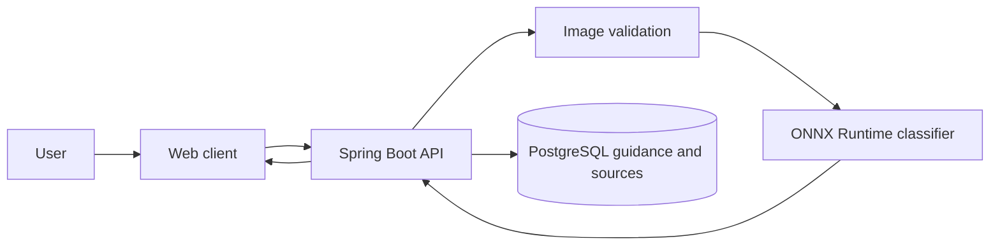
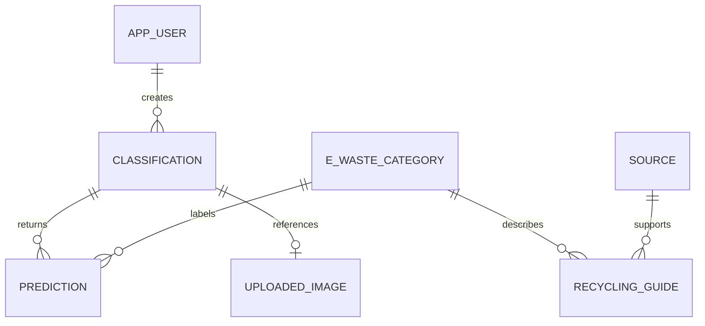
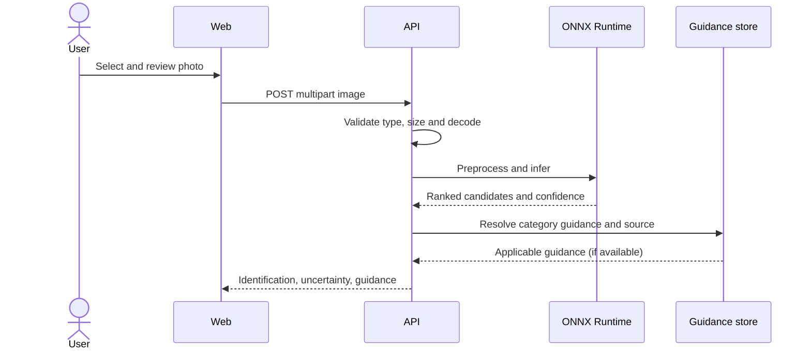

# Academic project material

## Abstract

This project proposes an e-waste identification and recycling assistant that combines image classification with practical preparation and safety guidance. The user supplies an image; a transfer-learning image classifier returns ranked candidate categories and a confidence estimate. Guidance is maintained separately from model code and can be associated with jurisdiction and source records. The system is designed to avoid fabricated recycling locations and to make uncertainty visible. Dataset, model metrics and deployment results must be filled with measured values after a licensed dataset and trained model are selected.

## Problem and objectives

People may not know what an electronic item is made of, how to prepare it for handover, or which collection channel accepts it. The objective is to provide a short identification-to-guidance workflow while protecting user images and distinguishing general advice from verified, jurisdiction-specific information.

## Existing and proposed systems

Generic search and disposal pages require users to identify items and reconcile information themselves. The proposed system provides one image-led flow, a confidence-aware classifier, structured guidance, source metadata and an optional classification history. A location is explicitly selected rather than silently inferred.

## Methodology

Start with a documented, licensed, class-balanced dataset where possible. Keep views of a physical object in one split. Use a 70/15/15 train/validation/test split unless dataset constraints require a documented alternative. Train a baseline CNN and MobileNetV2 transfer-learning model with realistic augmentation. Choose based on held-out accuracy, macro precision/recall/F1, per-class recall, confusion matrix, inference latency and model size. No results are asserted until the pipeline has been run.

## System architecture and diagrams

## Evaluation and limitations

Record dataset provenance, class distribution, split method, model version, metrics, hardware and latency. Analyze confusing pairs and false negatives. Lighting, occlusion, damaged products, unusual devices and domain shift can reduce performance. Image classification is not authoritative identification and recycling guidance must be checked against current official local sources.

## Future scope

Add secure accounts and deletion controls, administration for categories/sources/guidance, location-specific verified collection data, model versioning, robust evaluation, and user feedback review. Only add nearby locations when a verified data source is integrated.
